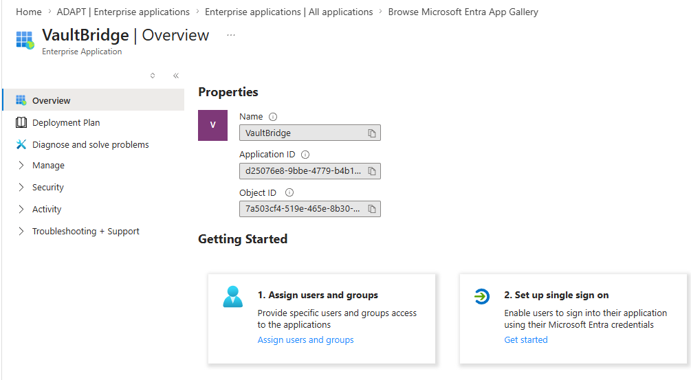
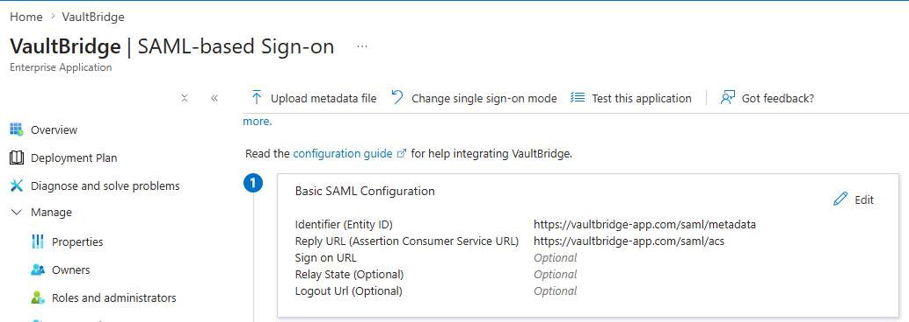
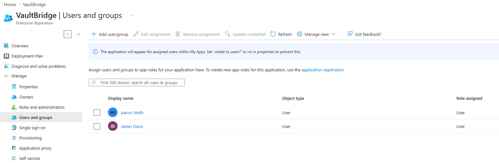
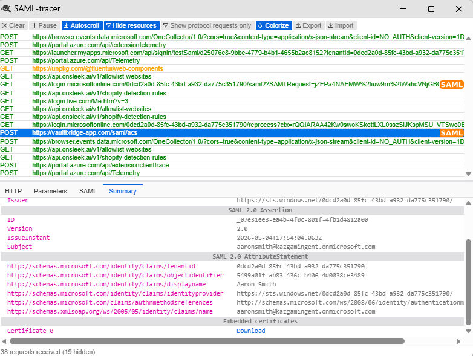

# Project 7 – Single Sign-On Federation with Microsoft Entra ID and SAML Tracer

---

## Overview

This project demonstrates the configuration of **Single Sign-On** between **Microsoft Entra ID** acting as the Identity Provider and a test enterprise application called **VaultBridge** acting as the Service Provider. The federation trust was established by configuring the Entity ID, Assertion Consumer Service URL, and SAML metadata. Test users were assigned to the application and a live SAML assertion was captured and inspected using the **SAML Tracer** browser extension, confirming the full authentication flow end to end.

---

## Environment

| Tool | Purpose |
|------|---------|
| Microsoft Azure Portal | Cloud identity platform and IdP configuration |
| Microsoft Entra ID | Identity Provider (IdP) for SAML federation |
| VaultBridge (Enterprise App) | Service Provider (SP) for SAML SSO test |
| SAML 2.0 | Authentication protocol for federated SSO |
| SAML Tracer (Browser Extension) | Live SAML assertion inspection and decode |
| GitHub | Documentation and version control |

---

## Lab Design

### SAML Configuration

| Setting | Value |
|---------|-------|
| Identity Provider | Microsoft Entra ID |
| Service Provider | VaultBridge |
| SSO Method | SAML 2.0 |
| Identifier (Entity ID) | https://vaultbridge-app.com/saml/metadata |
| Reply URL (ACS URL) | https://vaultbridge-app.com/saml/acs |
| Name ID Format | Email Address |
| Test Users Assigned | Aaron Smith, James Davis |

---

## Build Walkthrough

---

### 🟡 Step 1 — Registered VaultBridge as an Enterprise Application

Navigated to Microsoft Entra ID > Enterprise Applications > Browse Microsoft Entra App Gallery and added **VaultBridge** as a new enterprise application. Confirmed the application registered successfully with an Application ID and Object ID. The Getting Started panel showed the two required next steps — Assign users and groups and Set up single sign-on — confirming the app was ready for SSO configuration.

*VaultBridge Enterprise Application registered in Entra ID — Application ID and Object ID confirmed*

---

### 🔵 Step 2 — Configured SAML-Based Single Sign-On

Navigated to VaultBridge > Single Sign-On > SAML-based Sign-on. Configured the Basic SAML Configuration with the Entity ID and Assertion Consumer Service URL from the Service Provider. These two values establish the federation trust between Entra ID as the IdP and VaultBridge as the SP.

**SAML Configuration Applied:**
- Identifier (Entity ID): https://vaultbridge-app.com/saml/metadata
- Reply URL (ACS URL): https://vaultbridge-app.com/saml/acs

*VaultBridge SAML-based Sign-on — Entity ID and ACS URL configured, federation trust established*

---

### 🟠 Step 3 — Assigned Test Users to the Application

Navigated to VaultBridge > Users and Groups and assigned two test users — **Aaron Smith** and **James Davis** — to the application with the User role. Assigning users to the enterprise application controls who is authorized to authenticate via SSO. Only assigned users will receive a valid SAML assertion from the IdP.

*VaultBridge Users and Groups — Aaron Smith and James Davis assigned with User role confirmed*

---

### ✅ Step 4 — Captured and Inspected Live SAML Assertion

Triggered the SSO login flow as Aaron Smith and used the **SAML Tracer** browser extension to capture the live SAML 2.0 assertion in real time. The Summary tab confirmed the full SAML 2.0 Assertion with the correct Issuer, Subject, and AttributeStatement. Key claims were confirmed including tenant ID, object identifier, display name, identity provider, authentication method reference, and UPN.

**SAML Assertion Confirmed:**
- Issuer: https://sts.windows.net/[tenant-id]/
- Version: 2.0
- Subject: aaronsmith@kazgamingent.onmicrosoft.com
- Display Name: Aaron Smith
- Identity Provider: https://sts.windows.net/[tenant-id]/
- UPN: aaronsmith@kazgamingent.onmicrosoft.com

*SAML Tracer — live SAML 2.0 assertion captured showing Issuer, Subject, and AttributeStatement claims for Aaron Smith*

---

## Final Summary

| Step | Action | Result |
|------|--------|--------|
| App Registration | Added VaultBridge as Enterprise Application | App ID and Object ID confirmed |
| SAML Config | Set Entity ID and ACS URL | Federation trust established |
| User Assignment | Assigned Aaron Smith and James Davis | Both users authorized for SSO |
| SSO Test | Triggered login flow as Aaron Smith | SAML assertion captured successfully |
| Assertion Inspection | Decoded assertion in SAML Tracer | All claims confirmed correct |

---

## Skills Demonstrated

| Skill | How It Was Applied |
|-------|--------------------|
| SAML 2.0 Federation | Configured IdP and SP trust using Entity ID and ACS URL |
| Enterprise App Registration | Added and configured VaultBridge in Microsoft Entra ID |
| SSO Configuration | Set up SAML-based sign-on with correct metadata values |
| User Assignment | Controlled application access through user role assignment |
| SAML Assertion Inspection | Used SAML Tracer to decode live authentication assertions |
| Claims Analysis | Verified tenant ID, UPN, display name, and auth method claims |
| Identity Provider Config | Configured Microsoft Entra ID as the SAML IdP |

---

## Lessons Learned

**SAML federation is a trust relationship, not just a configuration.** The Entity ID and ACS URL are not arbitrary strings — they are the exact identifiers that tell the IdP where to send the assertion and how to identify the SP. If either value is wrong, the entire authentication flow fails. Understanding what each field does and why it must match exactly is what separates someone who followed a tutorial from someone who can troubleshoot a broken SSO integration.

**The SAML assertion is where identity claims live.** Every attribute in the assertion — the UPN, display name, tenant ID, object identifier, and authentication method — is what the Service Provider uses to make access decisions. IAM analysts need to be able to read a SAML assertion and immediately identify whether the right claims are being passed. If a user cannot access an application after SSO is configured, the assertion is the first place to look.

**User assignment is an access control, not an optional step.** Assigning users to the enterprise application in Entra ID determines who receives a valid SAML assertion. An unassigned user attempting SSO will be denied at the IdP level before they ever reach the application. This is a core least-privilege control — access to an application must be explicitly granted, not available to everyone by default.

---

## Real-World Application

Every major enterprise application — Salesforce, Workday, ServiceNow, Slack, and hundreds more — connects to a corporate Identity Provider via SAML or OIDC. IAM analysts configure these integrations, troubleshoot broken SSO flows, and maintain federation metadata when certificates expire or URLs change. Being able to capture a live SAML assertion, read the claims, and identify misconfiguration is a daily skill for anyone working in enterprise identity. This project demonstrates exactly that capability using real tools in a real Azure environment.

---

## References

- [Azure AD SAML SSO Documentation](https://learn.microsoft.com/en-us/azure/active-directory/develop/single-sign-on-saml-protocol)
- [Microsoft Entra Enterprise Applications](https://learn.microsoft.com/en-us/azure/active-directory/manage-apps/add-application-portal)
- [SAML Tracer Browser Extension](https://chromewebstore.google.com/detail/saml-tracer/mpdajninpobndbfcldcmbpnnbhibjmch)
- [NIST SP 800-63C – Federation and Assertions](https://pages.nist.gov/800-63-3/sp800-63c.html)
